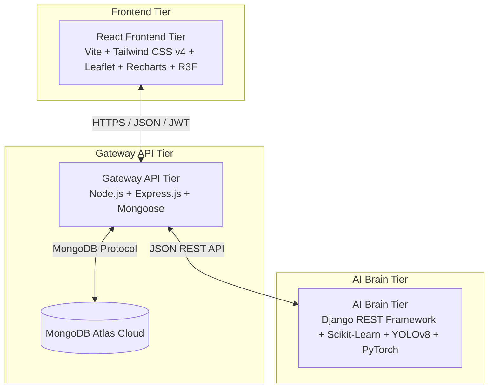

# 🧠 NeuroCity: Smart City Digital Twin Ecosystem
### *Semester 4 Major Project — Production Ready*

[](https://react.dev/)
[](https://tailwindcss.com/)
[](https://nodejs.org/)
[](https://expressjs.com/)
[](https://www.django-rest-framework.org/)
[](https://www.python.org/)
[](https://www.mongodb.com/atlas)

---

## 🌐 Core Vision & Problem Statement

Modern metropolitan centers suffer from severe **urban management fragmentation**. Municipal departments—such as traffic regulation, grid operations, weather telemetry, and public complaint systems—traditionally function in isolated silos. This disconnect results in:
* **Gridlocked Traffic Systems** that cannot react dynamically to emergency vehicles.
* **Inefficient Energy Grids** failing to adjust generation based on solar yield predictions.
* **Delayed Municipal Grievance Triage** due to manual classification of citizen tickets.

**NeuroCity** resolves these critical limitations by unifying disjointed municipal infrastructures into a **single, unified, and highly interactive digital twin command center**. Operating as a cognitive metropolitan operating system, NeuroCity combines real-time deep learning inference, machine learning energy predictions, and NLP-driven grievance classification into an ultra-premium dashboard.

---

## 🏗️ Hybrid Microservices Architecture

NeuroCity is engineered as a **3-Tier Distributed Architecture** that guarantees sub-second processing and extreme fault tolerance.



### 1. Frontend Tier (React + Vite + Leaflet + Recharts)
* **High-Fidelity UI**: Styled using Tailwind CSS v4, utilizing custom glassmorphic panels and dark-mode gradients for maximum visual impact.
* **Interactive GIS Mapping**: Employs `Leaflet` (`react-leaflet`) for spatial layout visualization of live cameras, municipal wards, and grid sectors.
* **Visual Telemetry**: Powered by `Recharts` to chart real-time atmospheric telemetry and predict energy demand profiles.
* **3D Simulation**: Includes `Three.js` (via `@react-three/fiber` & `@react-three/drei`) to render interactive city grid modules.

### 2. Gateway API Tier (Node.js + Express + Mongoose)
* **Access Control**: Handles secure JWT user authentication and session management.
* **Fail-Safe Integrity**: Intermediates requests from the client to the AI services, preventing client exposure to back-end AI endpoints.
* **Asynchronous Communication**: Implements Nodemailer with verification workflows (OTP + welcome letters).
* **Multi-Part Uploads**: Leverages Multer memory-storage limits (capped at 15MB) to process and proxy real-time CCTV frames to the AI microservice.
* **Cloud Persistence**: Interacts with MongoDB Atlas via Mongoose models, supporting logs caching and citizen complaints persistence.

### 3. AI Brain Tier (Django REST Framework + Python)
* **Model Weight Hosting**: Manages and serves Scikit-Learn `.pkl` weights and YOLOv8 computer vision models.
* **Deep Learning Inference**: Exposes API controllers executing fast inference pipelines.
* **High Compatibility**: Formatted strictly to consume multipart images or raw text payloads and return standardized JSON arrays.

---

## 🧠 Intelligence Modules Breakdown

NeuroCity houses four core intelligence engines designed to manage critical municipal vectors:

### 🏎️ 1. Traffic Eye (Computer Vision Optimization)
* **Model**: YOLOv8 (`yolov8s.pt` model weights) running object detection optimized for urban vehicle classes.
* **Dynamic Preemption (Green-Wave Routing)**: Automatically identifies ambulances and emergency response units at incoming junction approach paths.
* **Adaptive Control**: Automatically calculates optimal signal timers. Base green time ($15\text{s}$) is dynamically scaled up by $2\text{s}$ per detected vehicle (capped at $60\text{s}$), yielding maximum throughput. If an emergency vehicle is detected, it triggers a green-wave override immediately.

### ⚡ 2. Energy Sentinel (Predictive Grid Controller)
* **Model**: Python Scikit-Learn Random Forest Regressor models trained on regional historical datasets.
* **Scope**: Houses custom regional predictors for different states (`gujarat_energy_sentinel.pkl`, `maharashtra_energy_sentinel.pkl`, `uttarpradesh_energy_sentinel.pkl`).
* **Yield Prediction**: Forecasts municipal load demands and solar energy generation curves using inputs such as temperature, irradiation metrics, and grid capacity coefficients.

### 🌦️ 3. Climate & AQI Monitor (Atmospheric Data Engine)
* **Data Sources**: Integrated with OpenWeather Map APIs for live weather data.
* **CPCB Standardization**: Translates atmospheric composition (PM2.5, PM10, $NO_2$, $SO_2$, $CO$) into the standardized National Air Quality Index (AQI) values.
* **Forecasting**: Renders a 5-day temperature/humidity telemetry curve to anticipate weather-induced energy fluctuations.

### 🎫 4. Citizen Desk (NLP Grievance Triager)
* **Categorization Engine**: Text Classification pipeline utilizing a Linear Support Vector Classifier (`tfidf_vectorizer.pkl`).
* **Priority Triage**: Random Forest / Decision Tree model (`triage_rf_model.pkl`) that assesses multiple parameters:
  $$\text{Priority Rank} = f(\text{Category Severity}, \text{Proximity to Critical Infrastructure Wards}, \text{User History})$$
* **Alert Mechanism**: Generates instant notifications upon update of ticket status (`Pending` $\rightarrow$ `In Progress` $\rightarrow$ `Resolved`).

---

## 📂 Project Directory Structure

```
NeuroCity/
├── frontend/                     # React 19 + Vite + Tailwind CSS v4 Client
│   ├── src/
│   │   ├── components/           # Reusable UI (Navbar, TrafficHero, City3DScene, EnergySentinel, etc.)
│   │   ├── pages/                # Dashboards (GlobalHub, CitizenDesk, WeatherPage, SettingsPage)
│   │   ├── utils/                # API helpers and Auth bindings
│   │   ├── App.jsx               # Core application routing
│   │   ├── index.css             # Tailwind v4 Global Stylesheet
│   │   └── main.jsx              # React mounting file
│   ├── package.json              # Client Dependencies & scripts
│   └── vite.config.js            # Build configurations
│
├── backend-node/                 # Node/Express Gateway API
│   ├── config/                   # MongoDB Atlas DB connections
│   ├── middleware/               # Auth Guards & Multer configuration
│   ├── models/                   # Mongoose Schemas (User.js, Complaint.js, TrafficLog.js)
│   ├── routes/                   # Endpoints (auth.js, complaints.js, energy.js, traffic.js)
│   ├── utils/                    # Mail sending helpers
│   ├── server.js                 # Gateway entry server
│   └── .env                      # Node environment variables configuration
│
└── backend-django/               # Django AI Brain Microservice
    ├── citizen_complaints/       # NLP Text Triage classifier and views
    ├── energy_sentinel/          # Scikit-Learn solar load predictors
    ├── traffic_eye_api/          # YOLOv8 vehicle detection scripts
    ├── neurocity_project/        # Root routing and settings configurations
    ├── ml_artifacts/             # Fine-tuned weights directories
    ├── requirements.txt          # Python ML stack configuration
    └── .env                      # Django environment variables configuration
```

---

## ⚙️ Installation & Setup Instructions

Ensure you have **Node.js** (v18+), **Python** (v3.10+), and a running **MongoDB Atlas** account before starting.

### 🔐 1. Environment Configuration

Create a `.env` file in the respective directories as detailed below:

#### Gateway API Configuration (`backend-node/.env`):
```env
PORT=5000
MONGO_URI=mongodb+srv://<username>:<password>@cluster0.szer44a.mongodb.net/NeuroCity?retryWrites=true&w=majority
JWT_SECRET=NeuroCity_Stateless_SuperCrypt_Key_2026_##
OPENWEATHER_API_KEY=your_openweather_api_key_here
EMAIL_USER=your_configured_smtp_email@gmail.com
EMAIL_PASS=your_app_password_here
```

#### AI Brain Configuration (`backend-django/.env`):
```env
GCP_API_KEY=your_gcp_access_token_or_api_key_here
```

---

### 📦 2. Installing Dependencies & Execution

Follow these setup commands across three separate terminal instances:

#### Terminal 1: Node.js Gateway API
```bash
# Navigate to node workspace
cd backend-node

# Install NPM modules
npm install

# Start Express gateway using Nodemon
npm run start
```
*Gateway Server will initialize on:* `http://localhost:5000`

#### Terminal 2: Django AI Brain
```bash
# Navigate to django workspace
cd backend-django

# Setup Python Virtual Environment
python -m venv backend_env

# Activate Virtual Environment (Windows)
.\backend_env\Scripts\activate

# Install AI dependencies
pip install -r requirements.txt

# Run migrations and start server
python manage.py migrate
python manage.py runserver 0.0.0.0:8000
```
*AI Microservice will run on:* `http://localhost:8000`

#### Terminal 3: React Frontend Client
```bash
# Navigate to React app
cd frontend

# Install package configurations
npm install

# Boot local Vite development build
npm run dev
```
*Frontend Application will launch at:* `http://localhost:5173`

---

## 📊 System Endpoints Cheat-Sheet

For evaluation or automated route testing, you can hit the following endpoints:

| Service | Protocol / Route | Method | Payload / Description |
| :--- | :--- | :---: | :--- |
| **Gateway (Node)** | `/api/auth/register` | `POST` | Register User (Triggers Nodemailer OTP) |
| **Gateway (Node)** | `/api/auth/login` | `POST` | Login User (Generates JWT) |
| **Gateway (Node)** | `/api/traffic/analyze` | `POST` | Multipart Form: `traffic_image` |
| **Gateway (Node)** | `/api/complaints/submit` | `POST` | Body: `{ title, description, ward }` |
| **AI Brain (Django)**| `/api/traffic/analyze/` | `POST` | YOLOv8 vehicle class detection |
| **AI Brain (Django)**| `/api/energy/predict/` | `POST` | Random Forest state energy yield curves |
| **AI Brain (Django)**| `/api/complaints/triage/` | `POST` | NLP Grievance classification |
